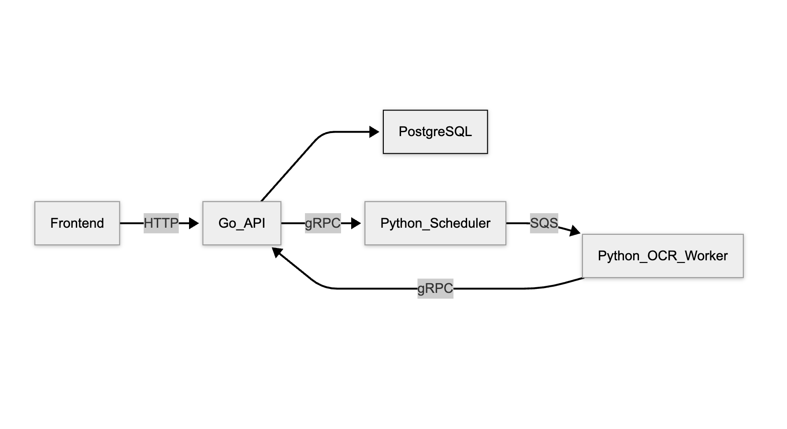

# CatDoc

A comprehensive document processing platform that combines OCR (Optical Character Recognition) and document classification capabilities with a modern web interface. Built with microservices architecture using Go, Python, and React.

## 🎬 Demo

https://github.com/user-attachments/assets/877d756a-cdc7-43b5-b306-3c11bc3e1abb

## 🏗️ Architecture

The application consists of several interconnected services:

- **Backend API Server** (Go) - RESTful API with JWT authentication
- **Document Processing Services** (Python) - OCR and classification workers
- **Scheduler Service** (Python) - gRPC-based job scheduling and queue management
- **Frontend Web App** (React + TypeScript) - Modern user interface
- **Database** (PostgreSQL) - Data persistence layer
- **Message Queue** (AWS SQS via LocalStack) - Asynchronous job processing

[](./docs/system-architecture.png)


## 🚀 Quick Start

### Prerequisites

- **Docker** or **Podman** (recommended for easy setup)
- **Make** (for development commands)
- **Go 1.24+** (for local backend development)
- **Node.js 18+** and **yarn** (for frontend development)

### Production Deployment

#### With Docker

```bash
# Clone the repository
git clone <repository-url>
cd ZTP

# Start all services
docker compose up -d
```

#### With Podman

```bash
# Use the Podman-specific compose file
podman-compose -f podman-compose.yaml up --build -d
```

This will:

1. Start PostgreSQL database
2. Run database migrations
3. Start the backend API server on port `:2137`
4. Launch OCR and classification workers
5. Start the scheduler service
6. Set up LocalStack for AWS services simulation

### Development Setup

#### Environment Configuration

Create environment configuration:

```bash
cp .env.example .env
```

Configure the values in `.env` according to your environment:

```bash
# Database Configuration
POSTGRES_DB=ztp
POSTGRES_HOST=postgres
POSTGRES_USER=postgres
POSTGRES_PASSWORD=your_password
POSTGRES_PORT=5432

# Server Configuration
SERVER_PORT=2137
SERVER_TIMEOUT=20

# JWT Configuration
JWT_ALGO=HS256
JWT_SECRET_KEY=your_secret_key

# AWS Configuration (LocalStack)
AWS_ACCESS_KEY_ID=test
AWS_SECRET_ACCESS_KEY=test
AWS_DEFAULT_REGION=us-east-1

# Service Ports
CLASSIFIER_CALLBACK_PORT=8090
OCR_CALLBACK_PORT=8091
SCHEDULER_PORT=50051
```

#### Backend Development

```bash
cd backend

# Install development tools
make install

# Start the database
make db-start

# Run database migrations
make migrate

# Generate code from SQL and protobuf
make generate

# Start development server with hot reload
make dev
```

Available backend commands:
- `make dev` - Start development server with hot reload
- `make run` - Run server without hot reload
- `make test` - Run tests
- `make lint` - Run linter
- `make build` - Build binaries
- `make migrate` - Run database migrations
- `make generate` - Generate code from SQL and protobuf definitions

#### Frontend Development

```bash
cd frontend

# Install dependencies
yarn install

# Start development server
yarn dev

# Other useful commands
yarn build          # Build for production
yarn test           # Run tests
yarn lint           # Run linter
yarn format         # Format code
```

## 🛠️ Technology Stack

### Backend
- **Go 1.24** - Primary backend language
- **Chi Router** - HTTP routing and middleware
- **JWT Auth** - Authentication and authorization
- **PostgreSQL** - Primary database
- **SQLC** - Type-safe SQL code generation
- **gRPC** - Inter-service communication
- **Logrus** - Structured logging

### Document Processing
- **Python 3.11+** - Document processing services
- **gRPC** - Service communication
- **AWS SQS** - Message queuing (via LocalStack)
- **Transformers** - ML models for OCR
- **Boto3** - AWS SDK for Python

### Frontend
- **React 18** - UI framework
- **TypeScript** - Type safety
- **Vite** - Build tool and dev server
- **Tailwind CSS** - Styling framework
- **Radix UI** - Accessible component primitives
- **React Hook Form** - Form management
- **Axios** - HTTP client
- **Vitest** - Testing framework

### Infrastructure
- **Docker** - Containerization
- **Docker Compose** - Multi-container orchestration
- **LocalStack** - AWS services simulation
- **Protocol Buffers** - Service definitions

## 📁 Project Structure

```
ZTP/
├── backend/                    # Backend services
│   ├── go/                    # Go API server
│   │   ├── cmd/              # Application entry points
│   │   ├── internal/         # Internal packages
│   │   └── api/              # API documentation
│   ├── python/               # Python services
│   │   ├── ocr/             # OCR worker service
│   │   ├── scheduler/       # Job scheduler service
│   │   └── gen/             # Generated protobuf code
│   ├── proto/               # Protocol buffer definitions
│   └── deployment/          # Docker configurations
├── frontend/                 # React frontend application
│   ├── src/
│   │   ├── features/        # Feature-based modules
│   │   ├── shared/          # Shared components and utilities
│   │   └── app/             # App configuration
│   └── public/              # Static assets
├── docs/                    # Documentation
├── docker-compose.yaml      # Docker services configuration
├── podman-compose.yaml      # Podman services configuration
└── .env.example            # Environment variables template
```

## 🔧 API Endpoints

### Authentication
- `POST /login` - User authentication
- `POST /register` - User registration

### Documents
- `GET /user/documents` - List user documents
- `POST /document` - Create new document
- `GET /document/{id}` - Get document details
- `DELETE /document/{id}` - Delete document
- `POST /document/{id}/ocr` - Trigger OCR processing

### Jobs
- `GET /job/{id}` - Get job status
- `GET /jobs` - List jobs

### Users
- `GET /user/{id}` - Get user profile
- `PUT /user/{id}` - Update user profile

## 🔄 Document Processing Workflow

1. **Upload** - User uploads document through frontend
2. **Storage** - Document stored in S3 (LocalStack)
3. **Job Creation** - Processing job created with unique ID
4. **Queue Processing** - Job sent to appropriate queue (OCR/Classification)
5. **Worker Processing** - Python workers process documents
6. **Callback** - Results sent back via gRPC callbacks
7. **Status Update** - Job status updated in database
8. **Notification** - Frontend receives processing results

## 🧪 Testing

### Backend Tests
```bash
cd backend
make test
```

### Frontend Tests
```bash
cd frontend
yarn test
yarn test:coverage
```

## 📊 Monitoring and Logging

- **Structured Logging** - JSON-formatted logs with contextual information
- **gRPC Health Checks** - Service health monitoring
- **Database Connection Pooling** - Efficient database connections
- **Error Handling** - Comprehensive error handling with proper HTTP status codes

## 🔒 Security

- **JWT Authentication** - Stateless authentication
- **CORS Configuration** - Cross-origin request handling
- **Input Validation** - Request validation and sanitization
- **SQL Injection Prevention** - Parameterized queries
- **Environment Variables** - Secure configuration management

## 🚀 Deployment

### Production Considerations

1. **Environment Variables** - Set production values for all configuration
2. **Database** - Use managed PostgreSQL service
3. **File Storage** - Use AWS S3 or compatible storage
4. **Load Balancing** - Use reverse proxy (nginx, HAProxy)
5. **SSL/TLS** - Enable HTTPS in production
6. **Monitoring** - Set up application monitoring
7. **Backup** - Implement database backup strategy

### Docker Production Build

```bash
# Build and run production containers
docker compose -f docker-compose.prod.yaml up -d
```

## 📈 Performance Optimization

- **Database Indexing** - Optimized database queries
- **Connection Pooling** - Efficient database connections
- **Caching** - Redis integration for caching (planned)
- **Async Processing** - Non-blocking document processing
- **Code Splitting** - Optimized frontend bundle sizes

## 📄 Documentation

- [Backend API Documentation](./backend/README.md)
- [Frontend Documentation](./frontend/README.md)
